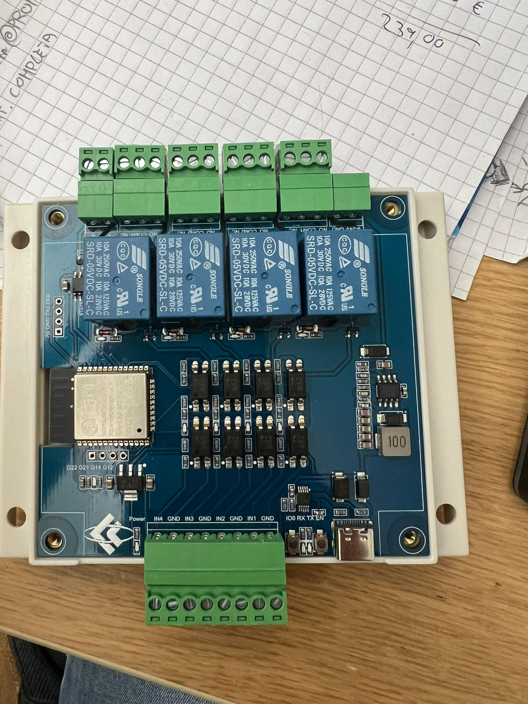

# ESP32 Relay X4 Modbus


Modbus RTU firmware for ESP32 4-channel relay boards with RS485.

This project provides a lightweight and reliable Modbus slave implementation for controlling relays and reading digital inputs.

---

## 📸 Hardware



Tested on:

* ESP32 Relay X4 Modbus board (v1.3) https://it.aliexpress.com/item/1005010277681749.html
* USB-C (CH340)
* RS485 onboard transceiver

---

## 📦 Features

* 4x Relay outputs
* 4x Digital inputs (optoisolated)
* RS485 Modbus RTU communication
* Fast response and low latency
* Compatible with industrial PLCs and SCADA systems

---

## 🔌 Wiring (RS485)

```
ESP32 Board        RS485 Master
-----------        --------------
A  (D+)   -------- A
B  (D-)   -------- B
GND       -------- GND (recommended)
```

⚠️ If communication fails:

* Try swapping A/B lines
* Ensure common ground between devices

---

## ⚙️ Modbus Configuration

| Parameter | Value |
| --------- | ----- |
| Slave ID  | 3     |
| Baudrate  | 9600  |
| Frame     | 8N1   |

---

## 📊 Register Map

### Relay Control (Holding Registers)

| Register | Description |
| -------- | ----------- |
| 0        | Relay 1     |
| 1        | Relay 2     |
| 2        | Relay 3     |
| 3        | Relay 4     |

Values:

* `0` = OFF
* `1` = ON

---

### Relay State (Input Registers)

| Register | Description   |
| -------- | ------------- |
| 0        | Relay 1 State |
| 1        | Relay 2 State |
| 2        | Relay 3 State |
| 3        | Relay 4 State |

---

### Digital Inputs (Input Registers)

| Register | Description |
| -------- | ----------- |
| 10       | IN1         |
| 11       | IN2         |
| 12       | IN3         |
| 13       | IN4         |

---

## 🔧 Pin Mapping

| Function | GPIO |
| -------- | ---- |
| Relay 1  | 23   |
| Relay 2  | 5    |
| Relay 3  | 4    |
| Relay 4  | 13   |
| Input 1  | 25   |
| Input 2  | 26   |
| Input 3  | 27   |
| Input 4  | 33   |
| RS485 RX | 18   |
| RS485 TX | 19   |
| RS485 DE | 32   |

---

## 🚀 Installation

1. Install Arduino IDE
2. Install ESP32 board support
3. Install required library:

   * `ModbusRTU (modbus-esp8266)`
4. Upload firmware:

```
firmware/esp32_relay_x4_modbus.ino
```

---

## 🔧 Usage

### Turn ON Relay 1

* Function: Write Holding Register
* Address: `0`
* Value: `1`

---

### Turn OFF Relay 1

* Function: Write Holding Register
* Address: `0`
* Value: `0`

---

### Read Relay State

* Function: Read Input Registers
* Address: `0`

---

### Read Digital Input 1

* Function: Read Input Registers
* Address: `10`

---

## 🧪 Tested With

* QModMaster
* Modbus Poll
* Boneio Black

---

## 🔌 Integrations

### BoneIO Black (Experimental)

This repository includes an optional controller configuration for BoneIO Black.

⚠️ Notes:

* Not officially supported yet
* Pending upstream PR
* May change in future

Location:

```
integrations/boneio/controller.json
```

Category:

```
Other
```

Supported:

* Relay control
* Relay state feedback
* Digital inputs

---

## ⚠️ Important Notes

* Relays are **active LOW**
* Inputs are **active LOW**
* RS485 requires correct DE control (GPIO32)
* GPIO13 (Relay 4) may behave differently at boot

---

## 📦 Project Structure

```
.
├── firmware/
│   └── esp32_relay_x4_modbus.ino
├── integrations/
│   └── boneio/
│       └── controller.json
├── docs/
│   └── board.jpg
├── README.md
```

---

## 📦 Roadmap

* [x] Modbus RTU firmware
* [x] Relay control
* [x] Input reading
* [ ] BoneIO official integration
* [ ] Configurable slave ID
* [ ] Configurable baudrate
* [ ] MQTT bridge

---

## 🤝 Contributing

Contributions are welcome!

* Open an issue
* Submit a pull request
* Suggest improvements

---

## 📜 License

MIT License
